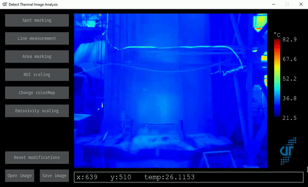
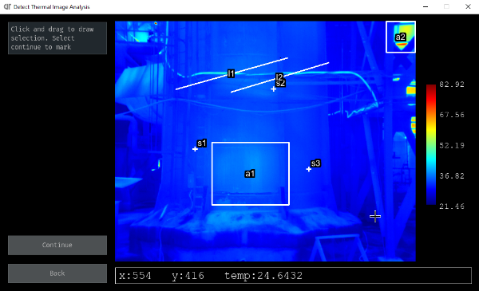
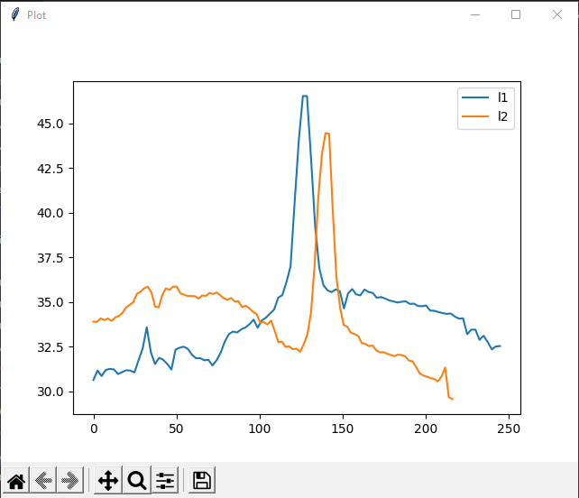
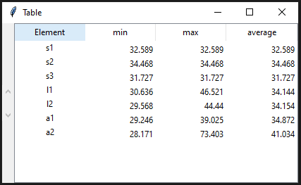
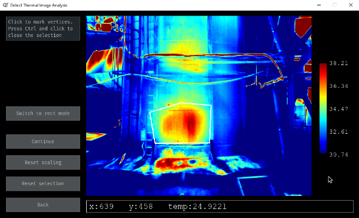
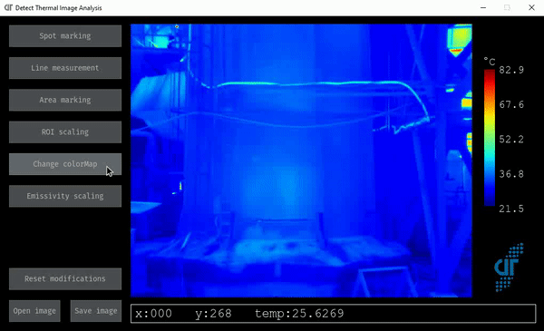
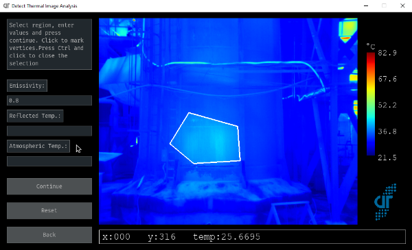
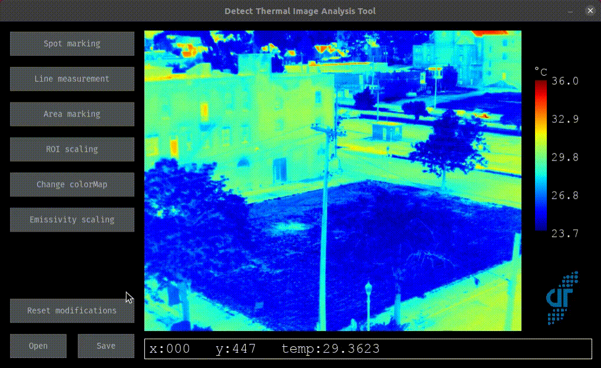

# Thermal Image Analysis
A tool for analyzing and annotating thermal images.

This repo relies on the [thermal_base python package](https://github.com/detecttechnologies/thermal_base) for image decoding and manipulation backend.

## Features

 Main menu

### Spot marking, line measurement and area marking

- Extract the temperature values at marked spots
- Plot temperature values along the marked line(s)
- Get min, max and average values of marked regions

Generates a plot for line plots and a table for measurements in the marked regions.

 Markings on the image.

    
    
     Plots and measurements.

### ROI scaling
Scale the entire image based on values in the marked region. Use to enhance low contrast areas.

 ROI scaling interface.

### Change colormap
Change colormap to one of the following options:

 Change colormap.

### Emissivity scaling
Change reflected apparent temperature and emissivity of marked region.

 Emissivity scaling interface.

### Save data
Image can be saved with or without markings, plots and values. Custom savefile(.pkl) saves all data and can be used to revive the previous session. New supported save extensions are :
 - CSV : Saves thermal values of a thermal image in Kelvin as a CSV format.
 - TIFF: Saves thermal values of a thermal image in Kelvin as a TIFF format.

 Saving process.

## Installation
 - Install [exiftool](https://exiftool.org/install.html)
 - Install [python](https://www.python.org/downloads/) 
 - Install thermal-analysis package installation
        - Install [Poetry](https://python-poetry.org/docs/)

    After you have installed poetry, type the following in your terminal/ powershell

        cd thermal-analysis
        poetry install
    Once all the dependencies are installed, you need to activate the environment variable. You can do that by typing the following command

        source $(poetry env info --path)/bin/activate

    Once done, you are ready to analyse!

## Usage
 - Run the program with

        python main.py

 - Select the thermal image file or the sample image. (Find some samples in `sample_images`)
 